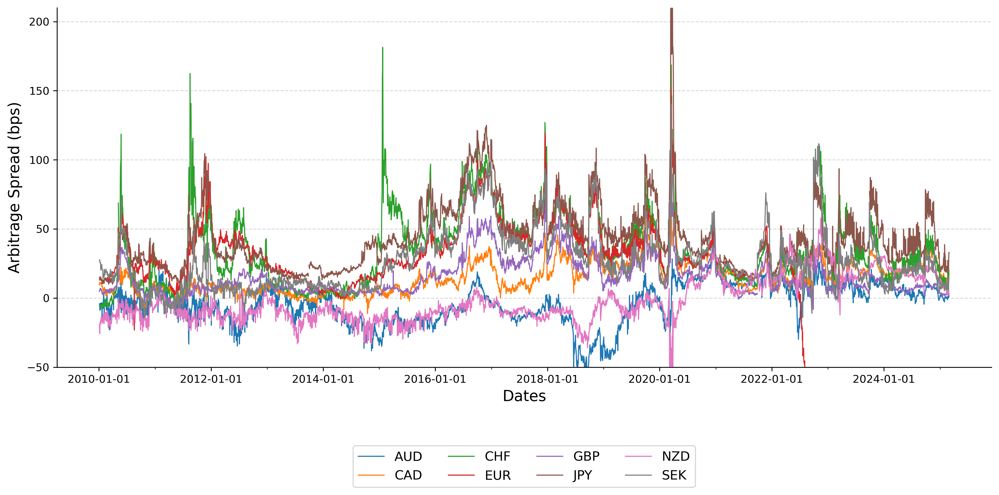

# **Covered Interest Parity**

### **Overview**
In this project, I researched Covered Interest Parity (CIP) arbitrage and used data sourced from Bloomberg to investigate the largest CIP spread deviations over the past decade.

The currencies analyzed include:
- **Swiss Franc (CHF)**
- **Euro (EUR)**
- **Pound Sterling (GBP)**
- **New Zealand Dollar (NZD)**
- **Australian Dollar (AUD)**
- **Swedish Krona (SEK)**
- **Japanese Yen (JPY)**
- **Canadian Dollar (CAD)**

---

### **Data Sources & Processing**
The dataset consists of:
- **Overnight Indexed Swap (OIS) rates**  
- **Spot exchange rates** for USD/CCY pairs  
- **Forward points**, which were converted into 3-month forward rates using standard market conventions:

$$
F_t = S_t + \frac{\text{FP}_t}{\begin{cases} 
    10,000, & \text{for most currency pairs (EUR, GBP, AUD, etc.)} \\
    100, & \text{for JPY}
\end{cases}}
$$

where:  
- \( F_t \) = 3-month forward rate  
- \( S_t \) = Spot exchange rate  
- \( FP_t \) = Forward points  

---

---

## **Key Takeaways**
✅ CIP deviations persist even in modern financial markets, contrary to theory.  
✅ Deviations widen during **market distress**, reflecting funding liquidity constraints.  
✅ The magnitude of deviations varies across currencies, with JPY and CHF showing larger anomalies.  

---

---

## **Results: CIP Arbitrage Spreads**
The following figure presents the arbitrage spreads for the selected currencies:

<h2 align="center">Time Series of Arbitrage Spreads</h2>

    

### **Description of the Plot**
- The y-axis represents the **CIP deviation** (arbitrage spread) in **basis points (bps)**.
- The x-axis represents the **timeline** (2010–2020).
- A **positive CIP deviation** indicates an arbitrage opportunity where synthetic funding is cheaper than direct USD funding.
- A **negative CIP deviation** suggests that direct USD funding is cheaper than synthetic funding.
- Large spikes (e.g., during the 2008–09 financial crisis and COVID-19 period) indicate periods of **market stress and liquidity constraints**.

## **Data Sources**
- **Spot exchange rates** (USD/CCY pairs)
- **Forward points** (converted to forward rates)
- **OIS rates** (used as risk-free rates)

All data was obtained from Bloomberg.

---

## **Future Work**
- Investigate how **cross-currency basis swaps** impact CIP deviations.
- Analyze **high-frequency data** for intra-day arbitrage opportunities.
- Explore the impact of **central bank interventions** on CIP deviations.

---

## **References**
- Du et al. (2018), *"Deviations from Covered Interest Parity"*, Journal of Finance.
- Rime et al. (2017), *"Interbank Market Liquidity and Arbitrage Spreads"*, BIS Working Paper.

---
